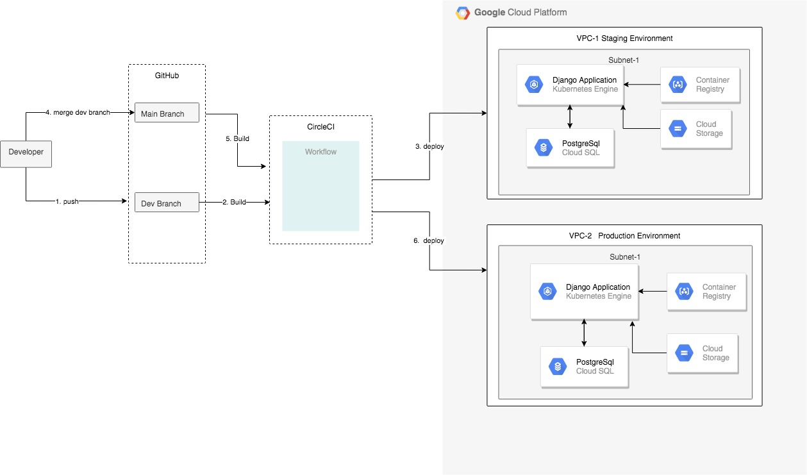

# Documentation

This is a classified advertisement web application developed using django framework. Beyond that, the main purpose of this project is to demonstrate the following topics: 
- Deploying and Running a django app on Google Kubernetes Engine (GKE)
- CI/CD piepline using CircleCI

**Architecture Diagram**  

The diagram below illustrates the infrasturcure, components invoved, and the whole workflow including the CI/CD pipeline.

<i> The Terraform config files, which are used to create the infrastructure both staging and production is located on the github repo, https://github.com/bezunesh/iac-classified-ad.git

**Directory Structures**
- **.circleci** : contains CicrcleCI pipleline configuration files.
- **k8**: contains kubernetes config files
- **environments**: contains relevant config files for staging and production environments
  
- **ad**: django apps folder
- **classified**: django project folder
  
## How Tos

### Check the live application

> Staging Frontend: Go to http://35.245.176.7  
> Staging Backend: Go to http://35.245.176.7/admin  
>
> Production Frontend: Go to http://35.245.176.7  
> Production Backend: Go to http://35.245.176.7/admin

### Run the app locally

#### Prerquisites

- Python3 installed
- PostgreSQL installed
- Create a database. Name: classified-ad
- Create a database user, and grant access to the database

#### Setup

    # clone the project
    git clone https://github.com/bezunesh/classified-ad

    # create virtual environment and install dependecies
    python3 -m venv venv
    source  venv/bin/activate
    pip install -r requirements.txt

    # Create environment variables
    export DATABASE_USER=db-user-name
    export DATABASE_PASSWORD=password

    # collect static files
    (venv)$ python manage.py collectstatic
    
    # run database migration
    (venv)$ python manage.py migrate

    # run the app
    python manage.py runserver

    # check the running app:
    http://127.0.0.1:8080

    # create backend/admin user
    python manage.py createsuperuser
    # follow the screen instruction
    # access the backend on
    http://127.0.0.1:8080/admin

### Deploy the app on GKE

Prerequisites

- create the infrasturcture using the terraform code found on repo : https://github.com/bezunesh/iac-classified-ad.git
- a GCP project, name : django-classified-ad
- a service account key file with role Cloud SQL admin
- enable GCP APIS: Google Compute Engne, Kubernetes Engine, Cloud SQL Admin
- python 3 installed locally
- gcloud sdk installed locally

### Setup

    # clone the project
    git clone https://github.com/bezunesh/classified-ad

    # gcloud login 
    gcloud auth login myname@gmail.com

    # gcloud set project, zone and region
    gcloud config set project django-classified-ad
    gcloud config set compute/region us-east4
    gcloud config set compute/zone us-east4-a

    # build and push docker image
    docker build -t gcr.io/django-classified-ad/classified-ad
    docker push gcr.io/django-classified-ad/classified-ad

    # create a cloud storage bucket and set a public access
    gsutil mb gs://django-classified-ad
    gsutil defacl set public-read gs://django-classified-ad
    
    # copy the static files 
    # make sure you have run the 'collectstatic' command locally as mentioned in the section - run the app locally 
    gsutil -m rsync -r ./static gs://django-classified-ad/static 

    # to deploy to staging
    cd environment/staging  
     or
    # to deploy to production
    cd environemnt/production

    # connect to the staging cluster, if deploying to staging
    gcloud container clusters get-credentials cluster-staging  
    or
    # connect to the production cluster, if deploying to production
    gcloud container clusters get-credentials cluster-production

    # create db username and password
    kubectl create secret generic cloudsql --from-literal=username=[DATABASE_USERNAME] --from-literal=password=[PASSWORD]

    # create credential for accessing Cloud SQL instance
    kubectl create secret generic cloudsql-credentials --from-file=credential.json=[PATH_TO_CREDENTIAL_FILE]

    # create configmap - it sets the cloud sql connection string for the relevant environment
    kubectl create -f configmap.yaml

    # create deployment and the load balancer service
    kubectl create -f classified-ad.yaml

    # make sure the pods are running
    kubectl get pods

    # database migration and admin user
    # using cloud-shell connect to one of the pods's classifiedad-app container
    # example pid id: classifiedad-7b84cddb6b-j5fxj
    kubectl exec --stdin --tty classifiedad-7b84cddb6b-j5fxj -c classifiedad-app -- /bin/bash 

    # now that we are inside the container
    # do db migration
    python3 -m venv venv
    source venv/bin/activate
    pip install -r requirements.txt
    python manage.py migrate

    # create backend/admin user
    python manage.py createsuperuser

    # follow the on-screen instruction to complete the user creation

    # see the running app, and take a note of the external-ip
    kubectl get services classifiedad

    NAME           TYPE           CLUSTER-IP      EXTERNAL-IP 
    classifiedad   LoadBalancer   10.59.249.176   34.86.75.60 

    # go to the external-ip in your browser to see it running
    # append /admin to the external-ip - to see the backend 